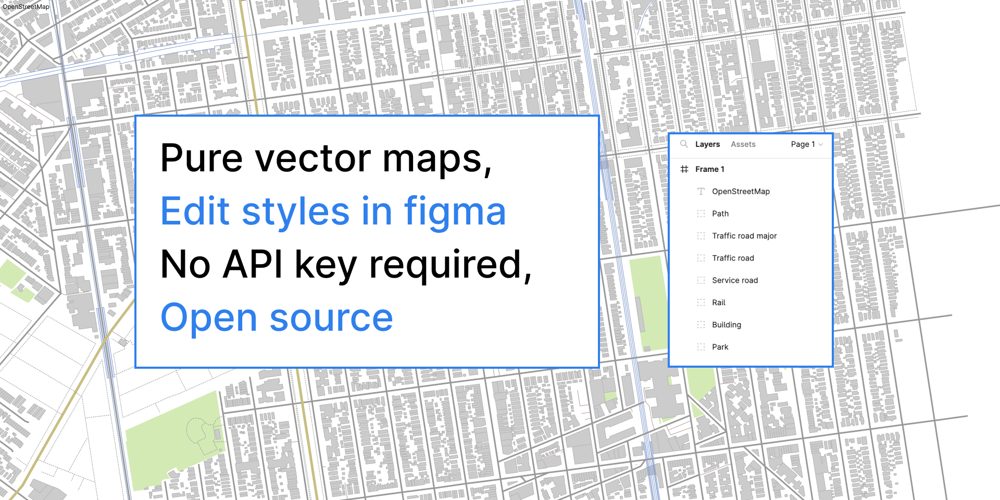

# figma-plugin

Make maps in [Figma](https://www.figma.com/) using [OpenStreetMap](https://www.openstreetmap.org/)
data. This plugin directly transforms live OpenStreetMap into a vector map in Figma.
It's similar in spirit, technically, to the renderer in [iD](https://github.com/openstreetmap/iD),
but much simpler.

|                                   | **placemark** | **mapbox-based plugins**         |
|-----------------------------------|---------------|----------------------------------|
| edit map styles                   | in figma      | in mapbox studio                 |
| scales supported                  | local only    | all scales, global to local      |
| street labeling                   | not yet       | yes                              |
| output                            | vector        | raster                           |
| unlimited printing & reproduction | yes           | no (mapbox tos has requirements) |
| api key required                  | no            | yes                              |

## Development

The `build` script will continuously build and update this plugin.

You can use this plugin locally by going
to Plugins → Development → Import plugin from manifest…

## Usage

Create an empty frame in Figma. With it selected, start the Placemark plugin.
Select an area, click **Render**.
